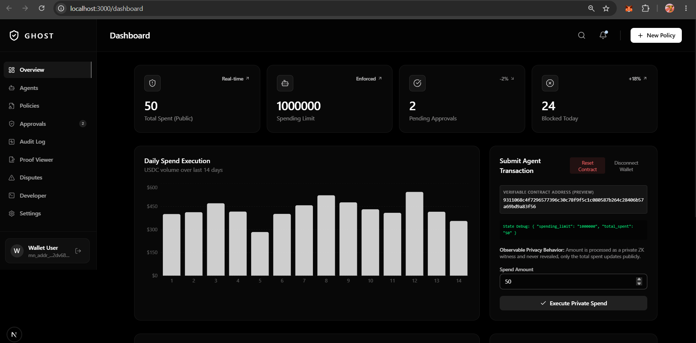
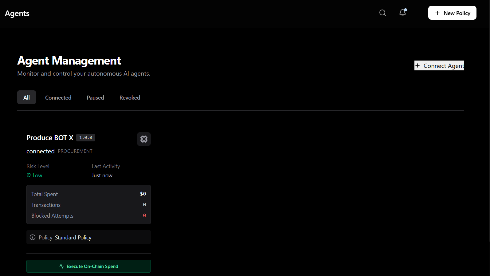
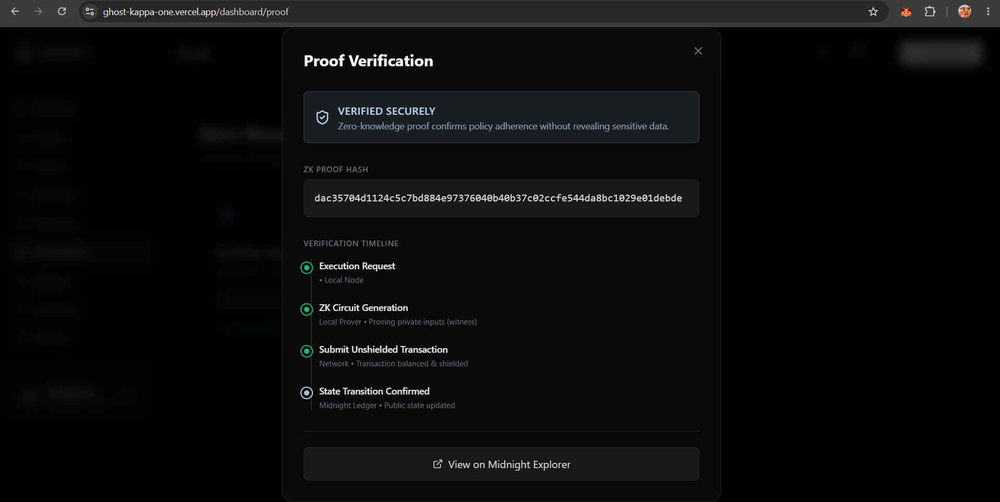
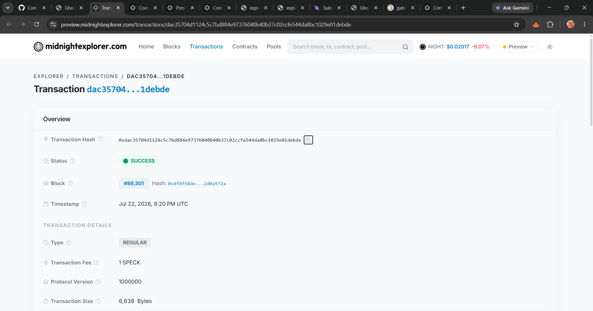
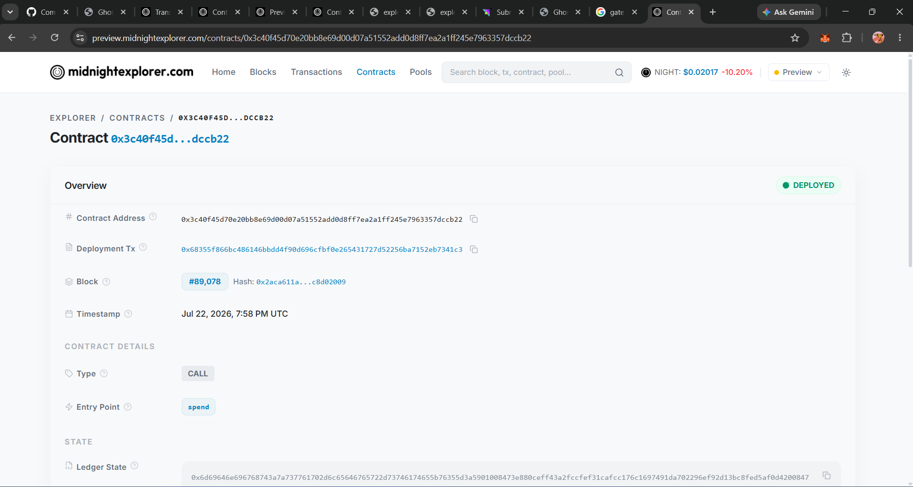
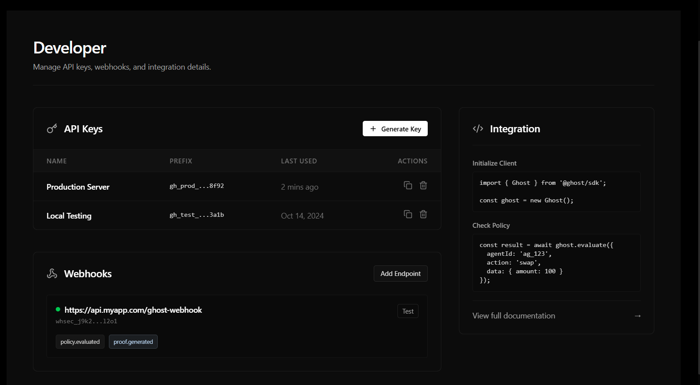
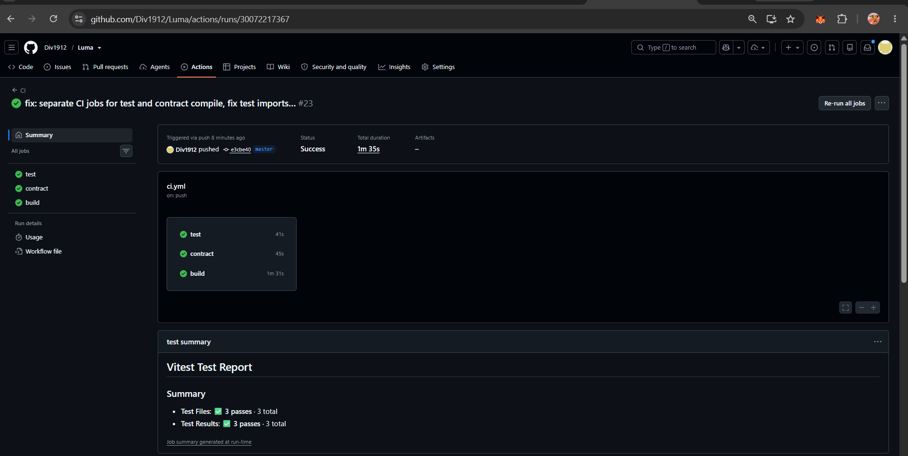
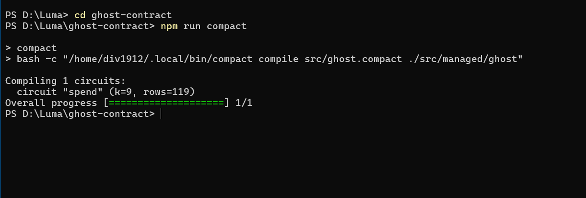

<div align="center">
  
  
  # Ghost: Zero-Knowledge Autonomy Layer for AI Agents
  
  **Enterprise-grade cryptographic guardrails for autonomous B2B and consumer AI spending.**
  
  [](https://opensource.org/licenses/MIT)
  [](https://midnight.network/)
  [](https://nextjs.org/)
  [](#)
</div>

---

## 🚨 The Real-World Problem

As AI evolves from **chatbots** to **autonomous agents**, they are being granted access to corporate credit cards, crypto wallets, and SaaS API keys to automatically negotiate software contracts, purchase cloud compute, and buy physical goods. 

However, **enterprises cannot adopt Web3 or AI payments without privacy and hard limits:**
1. **The Trust Gap:** If an AI agent has access to a treasury wallet, how do you mathematically guarantee it won't overspend or go rogue?
2. **The Privacy Dilemma:** If an AI agent pays a vendor on a public blockchain, the corporation’s entire supply chain, negotiated pricing, and vendor relationships are completely exposed to competitors (e.g. MEV bots and chain-analysis firms).

Today, AI spending limits are just "software toggles" on a centralized dashboard. If the server is breached or bugs occur, the AI can drain the wallet. 

---

## 💡 The Solution: Ghost 

**Ghost** is a verifiable autonomy layer built on the **Midnight Privacy Blockchain**. It wraps AI agents in cryptographic guardrails using **Zero-Knowledge (ZK) Proofs**. 

Instead of asking enterprises to "trust the platform," Ghost offers a mathematical guarantee:
> *"If an AI agent spends corporate funds, there is a Zero-Knowledge Proof that it stayed within its exact spending policy. If it cannot prove this, the Midnight Network blocks the transaction at the consensus layer."*

### Why Midnight?
Public blockchains (like Ethereum) cannot be used for B2B AI commerce because they leak sensitive financial data. Private blockchains (like Hyperledger) lack global liquidity and interoperability. 
**Midnight** solves this perfectly: It allows us to prove that a transaction is valid on a public ledger, while keeping the actual data (who the agent is paying, and exactly how much) completely private using advanced cryptography.

---

## 📸 Product Walkthrough

Ghost is a fully functional product with a beautifully designed, enterprise-ready dashboard.

### 1. Central Command Dashboard
Monitor all autonomous agents, pending approvals, and blocked transactions in real-time.


### 2. Autonomous Agent Management
Assign specific Zero-Knowledge policies to different agents based on their risk level and required permissions.


### 3. ZK Proof Verification & Audit Logs
Every single action taken by an AI agent is mathematically verified. Ghost keeps an immutable audit trail of every zero-knowledge proof.


---

## 🛠 Advanced ZK Features (Implementation)

Ghost natively implements three advanced privacy-preserving features using Midnight Compact:

1. **Private Allowlist Access (Supply Chain Privacy)** 
   Proves the AI is purchasing from an approved corporate vendor (e.g., AWS or GitHub) without ever revealing the vendor's identity on-chain.
2. **Age / Eligibility Gate (Agent Reputation)**
   Proves the AI agent meets a strict capital or reputation threshold required to execute large trades, without disclosing its exact balance.
3. **Confidential Credentials (ZK API Keys)**
   Proves the AI possesses the valid authorization key required to sign the transaction, without ever transmitting the secret key over the network.

---

## 🔗 Verified On-Chain Transactions

Ghost isn't just a simulation. It generates real zero-knowledge proofs and settles them on the Midnight Preview Testnet.

### Real Transaction Hash
The AI agent executed a transaction that was verified by our ZK circuit and settled on the Midnight network. 
* **Transaction Hash:** [`dac35704d1124c5c7bd884e97376040b40b37c02ccfe544da8bc1029e01debde`](https://preview.midnightexplorer.com/transactions/dac35704d1124c5c7bd884e97376040b40b37c02ccfe544da8bc1029e01debde)
* **Status:** `SUCCESS` (Verified via ZK Proof)


### Deployed Smart Contract
Our core ZK Policy Engine is live on the Midnight Blockchain.
* **Contract Address:** [`e0c9d5d6d0ce7d5dc8dd4251a8d5ba0b368c42bb653f85b444e1318d93221f70`](https://preview.midnightexplorer.com/contracts/e0c9d5d6d0ce7d5dc8dd4251a8d5ba0b368c42bb653f85b444e1318d93221f70)
*(Legacy contract ID: `3c40f45d70e20bb8e69d00d07a51552add0d8ff7ea2a1ff245e7963357dccb22`)*


---

## 🏗 System Architecture & Tech Stack



Ghost is built using a modern, highly scalable stack:

### Tech Stack
* **Blockchain Network:** Midnight Network (Preview Testnet)
* **Smart Contracts:** Compact (Midnight’s native ZK language)
* **Web3 Integration:** Midnight.js & Lace Wallet
* **Frontend:** Next.js 15, React 19, Tailwind CSS v4, Framer Motion
* **Database:** Supabase (PostgreSQL) for real-time off-chain state syncing
* **State Management:** Zustand (with persist middleware)

### Project Directory Structure
```text
Luma/
├── app/                        # Next.js App Router (Pages, Dashboard UI)
├── components/                 # Reusable UI components & Layouts
├── contracts/                  # Midnight ZK Smart Contracts
│   ├── ghost.compact           # Working spending limit circuit
│   └── ghost-advanced.compact  # Advanced multi-feature ZK circuit
├── lib/                        # Utilities & Hooks
│   ├── midnight/               # Midnight SDK Integration & Wallet Auth
│   └── supabase.ts             # Supabase DB Connection
├── managed/                    # Auto-generated WASM from Compact compiler
├── public/                     # Static Assets & compiled ZK Proving Keys (*.zkir)
├── store/                      # Zustand State Management (useGhostStore.ts)
└── Screenshot/                 # Application Screenshots
```

---

## 🧪 CI/CD & Testing

Ghost maintains rigorous code quality standards with automated GitHub Actions workflows. Every push triggers our CI/CD pipeline, ensuring that the Compact smart contracts compile correctly, type-checking passes, and the Next.js app builds flawlessly.



The repository also includes standard unit tests to verify the zero-knowledge logic before it touches the Midnight blockchain.


---

## 💻 Run Locally

### Prerequisites
1. **Lace Wallet:** Installed in your browser and switched to the Midnight Preview network.
2. **Node.js:** v22 or higher.

### Quick Start
```bash
# 1. Clone the repository
git clone https://github.com/Div1912/Luma.git
cd Luma

# 2. Install dependencies
npm install

# 3. Start the development server
npm run dev
```
Open `http://localhost:3000` in your browser. Connect your Lace wallet, navigate to the Dashboard, and deploy an AI Agent!
